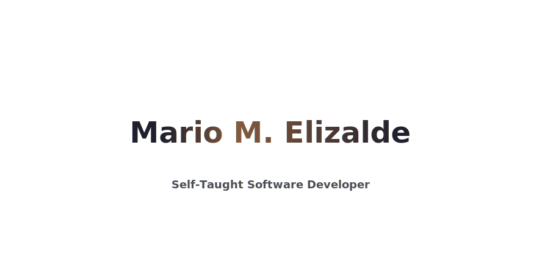

### What's up 🙏🏽

<!------
**marioebros/marioebros** is a ✨ _special_ ✨ repository because its `README.md` (this file) appears on your GitHub profile. ------>

 
<h2 align="center">Introduction</h2>

    My name is Mario Elizalde and I am a self-taught developer with about 1 year of experience. I'm currently looking to make the transition from an Email Copywriter to a software developer role. Have a look through my repos and feel free to reach out if you want to discuss anything that you see here.

    Talk soon,
    Mario

 

  

 

- 🇲🇽 I’m currently working on expanding my knowledge of full-stack web development & web3.
- 💈 I’m currently learning advanced Javascript leading into more work with JS frameworks including: Node.js, Next.js, & React.
- 🛸 Ask me about my experience renting apartments in Manhattan and working as a recording engineer in LA!
- 🙏🏽 Fun fact: I'm also a classically trained trombonist with 10+ years of touring experience.

 
<h2 align="center">Frequently Used Technologies</h2>

  
     
  
  
  
      
     
   
    
  
  
  
  
  
  
  
  
  
  
  
  
  
  
  
  
  
  
  
  
  
  
  
  
  
  

 

  <figure><embed src="https://wakatime.com/share/@09ded259-8d57-432d-acbe-fd998a4351d0/7aa585de-a512-4b79-bd0a-6fc7f05f3ece.svg"></embed></figure>
  <!------ https://github-readme-stats.vercel.app/api/top-langs/?username=pmbechard&theme=blue-green ------>

 

 
<h2 align="center">Check out some of my recent projects:</h2>

1. My largest project to date! An updated personal portfolio website built using: TypeScript, React, Next.js, Tailwind CSS, Sanity.io(CMS), & deployed on Vercel: [Live](https://portfolio-mme.vercel.app/) [Repo](https://github.com/marioebros/portfolio)
2. Another practical application for JavaScript development in a "To-Do" App built using: JavaScript, CSS, & Webpack: [Live](https://marioebros.github.io/toDo-list/) [Repo](https://github.com/marioebros/toDo-list)
3. A sample restaurant page for a fictional business "G's" made with JavaScript, CSS, & Webpack: [Live](https://marioebros.github.io/restaurant-page/) [Repo](https://github.com/marioebros/restaurant-page)
4. An online "pocket" library application made with HTML, CSS, and JavaScript: [Live](https://marioebros.github.io/library-app/) [Repo](https://github.com/marioebros/library-app)
5. A JavaScript built calculator replica made with HTML, CSS, & of course, JavaScript: [Live](https://marioebros.github.io/project-calculator/) [Repo](https://github.com/marioebros/project-calculator)
6. A Rock, Paper, Scissors standalone game vs. The Computer, made with case using: JavaScript, CSS, & HTML: [Live](https://marioebros.github.io/project-rock-paper-scissors/) [Repo](https://github.com/marioebros/project-rock-paper-scissors)

 
<h2 align="center">Feel free to hit me up using the links below. Thanks for visiting!</h2>

  
  

